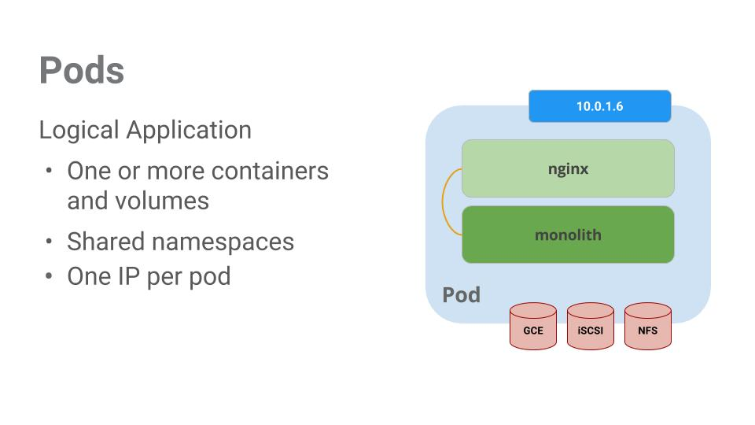
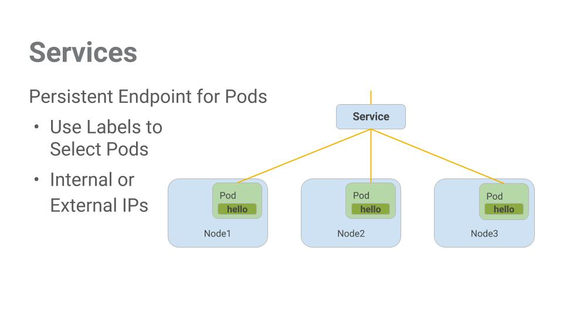

# Orchestrating the Cloud with Kubernetes
## **Goals**
- `Kubernetes Engine`이용하여 `Kubernetes cluster` 공급 
- kubectl 명령어 이용해서 Docker container 배포 & 관리
- Kubernetes 배포방법과 서비스를 이용해서 application을 microservice로 나누기

### App 
- `kelseyhightower/monolith` - Monolith includes auth and hello services.
- `kelseyhightower/auth` - Auth microservice. Generates JWT tokens for authenticated users.
- `kelseyhightower/hello` - Hello microservice. Greets authenticated users.
- `nginx` - Frontend to the auth and hello services.

## **Task 1. Get theh sample code**
```shell
gsutil cp -r gs://spls/gsp021/* .
cd orchestrate-with-kubernetes/kubernetes
ls
```
## **Task 2. Quick Kubernetes Demo**
```shell
kubectl create deployment nginx --image=nginx:1.10.0
```
```shell
kubectl get pods
```
```shell
kubectl expose deployment nginx --port 80 --type LoadBalancer
```

>  Kubernetes created an external Load Balancer with a public IP address attached to it

```shell
kubectl get services
```

```shell
curl http://<External IP>:80
```

## **Task 3.  [`Pods`](https://kubernetes.io/docs/concepts/workloads/pods/)**

Pods represent and hold **a collection of one or more containers**. Generally, if you have multiple containers with a hard dependency on each other, you **package the containers inside a single pod**.  
Pods also have **Volumes**. Volumes are data disks that live as long as the pods live, and can be used by the containers in that pod. Pods provide a **shared namespace** for their contents which means that the two containers inside of our example pod **can communicate with each other**, and they also **share the attached volumes**.   
Pods also **share a network namespace**. This means that there is one IP Address per pod. 

## **Task 4. Creating Pods**
```shell
cd ~/orchestrate-with-kubernetes/kubernetes
```
```shell
cat pods/monolith.yaml # 설정파일 확인
```
```text
apiVersion: v1
kind: Pod
metadata:
  name: monolith
  labels:
    app: monolith
spec:
  containers:
    - name: monolith
      image: kelseyhightower/monolith:1.0.0
      args:
        - "-http=0.0.0.0:80"
        - "-health=0.0.0.0:81"
        - "-secret=secret"
      ports:
        - name: http
          containerPort: 80
        - name: health
          containerPort: 81
      resources:
        limits:
          cpu: 0.2
          memory: "10Mi"
```

```shell
kubectl create -f pods/monolith.yaml # yaml파일 이용해서 생성
```

```shell
kubectl get pods # pods 확인
```

```shell
kubectl describe pods monolith # 특정 pods 확인
```

## **Task 5. Interacting with pods ⭐**
By default, pods are allocated a **private IP** address and cannot be reached outside of the cluster. Use the **kubectl port-forward command** to map a local port to a port inside the monolith pod.

```shell
# 2nd terminal
kubectl port-forward monolith 10080:80
# 1st terminal
curl http://127.0.0.1:10080
```

```shell
curl http://127.0.0.1:10080/secure
```

```shell
curl -u user http://127.0.0.1:10080/login
```

```shell
TOKEN=$(curl http://127.0.0.1:10080/login -u user|jq -r '.token')
```

```shell
curl -H "Authorization: Bearer $TOKEN" http://127.0.0.1:10080/secure
```

```shell
# 3rd terminal
kubectl logs monolith
```

```shell
kubectl logs -f monolith #real-time log

curl http://127.0.0.1:10080

kubectl exec monolith --stdin --tty -c monolith -- /bin/sh

ping -c 3 google.com

exit
```

## **Task 6. Service**

Pods aren't meant to be persistent. They can be **stopped or started for many reasons** - like failed liveness or readiness checks - and this leads to a problem:

What happens if you want to communicate with a set of Pods? When they get restarted they might have a different IP address.

That's where Services come in. Services provide stable endpoints for Pods.

Services use labels to determine what Pods they operate on. If Pods have the correct labels, they are automatically picked up and exposed by our services.

The level of access a service provides to a set of pods depends on the Service's type. Currently there are three types:

- ClusterIP (internal) -- the default type means that this Service is only visible inside of the cluster,
- NodePort gives each node in the cluster an externally accessible IP and
- LoadBalancer adds a load balancer from the cloud provider which forwards traffic from the service to Nodes within it.

## **Task 7. Creating a service**
Before you can create our services, first create a secure pod that can handle https traffic.

```shell
cd ~/orchestrate-with-kubernetes/kubernetes  

cat pods/secure-monolith.yaml

kubectl create secret generic tls-certs --from-file tls/
kubectl create configmap nginx-proxy-conf --from-file nginx/proxy.conf
kubectl create -f pods/secure-monolith.yaml

cat services/monolith.yaml

kubectl create -f services/monolith.yaml

gcloud compute firewall-rules create allow-monolith-nodeport \
  --allow=tcp:31000
```

## **Task 8. Adding labels to pods**
Currently the monolith service does not have endpoints. One way to troubleshoot an issue like this is to use the kubectl get pods command with a label query.

You can see that you have quite a few pods running with the monolith label.
```shell
kubectl get pods -l "app=monolith" # 라벨로 찾기
```
But what about "app=monolith" and "secure=enabled"?
```shell
kubectl get pods -l "app=monolith,secure=enabled"
```
> secure=enabled label 추가하자

```shell
kubectl label pods secure-monolith 'secure=enabled'
kubectl get pods secure-monolith --show-labels
```
Now that your pods are correctly labeled, view the list of endpoints on the monolith service:

```shell
kubectl describe services monolith | grep Endpoints
```
Test this out by hitting one of our nodes again.

```shell
gcloud compute instances list
curl -k https://<EXTERNAL_IP>:31000
```
## **Task 9. Deploying applications with Kubernetes**

The goal of this lab is to get you ready for **scaling and managing containers in production**. That's where Deployments come in. Deployments are a declarative way to ensure that the number of Pods running is equal to the desired number of Pods, specified by the user.

The main benefit of Deployments is in abstracting away the low level details of managing Pods. Behind the scenes Deployments use Replica Sets to manage starting and stopping the Pods. If Pods need to be updated or scaled, the Deployment will handle that. Deployment also handles restarting Pods if they happen to go down for some reason.


Pods are tied to the lifetime of the Node they are created on. In the example above, Node3 went down (taking a Pod with it). Instead of manually creating a new Pod and finding a Node for it, your Deployment created a new Pod and started it on Node2.

That's pretty cool!

It's time to combine everything you learned about Pods and Services to break up the monolith application into smaller Services using Deployments.

## **Task 10. Creating deployments**
- auth - `Generates JWT tokens` for authenticated users.
- hello - `Greet authenticated users`.
- frontend - `Routes traffic` to the auth and hello services.

You are ready to create deployments, one for each service. Afterwards, you'll define internal services for the auth and hello deployments and an external service for the frontend deployment. Once finished you'll be able to `interact with the microservices` just like with Monolith only now each piece will be able to be scaled and deployed, independently!


```shell
cat deployments/auth.yaml

kubectl create -f deployments/auth.yaml

kubectl create -f services/auth.yaml

kubectl create -f deployments/hello.yaml
kubectl create -f services/hello.yaml

kubectl create configmap nginx-frontend-conf --from-file=nginx/frontend.conf
kubectl create -f deployments/frontend.yaml
kubectl create -f services/frontend.yaml

kubectl get services frontend

curl -k https://<EXTERNAL-IP>
```