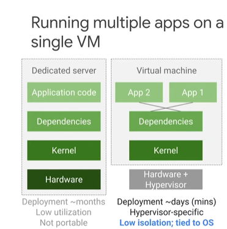
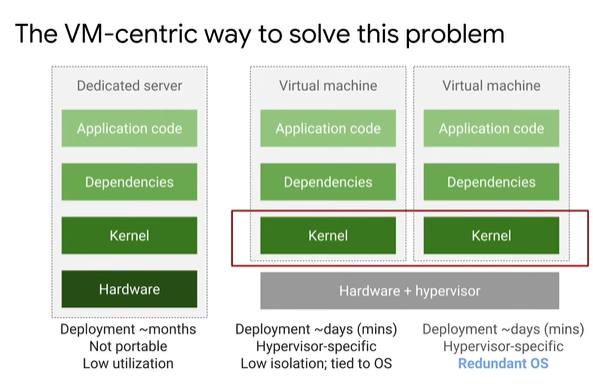
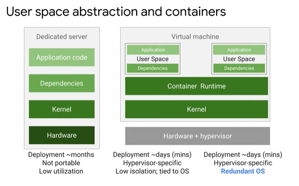
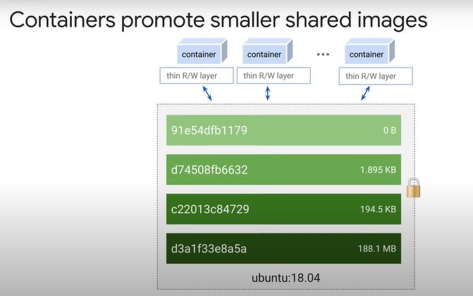
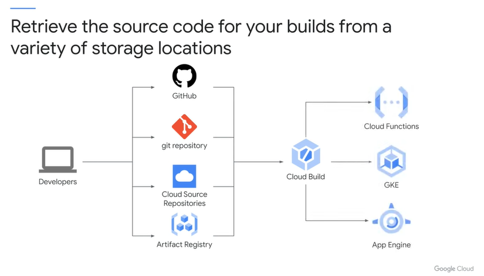
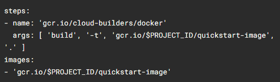

# Container란?
## Running Multiple Apps on a single VM
- 단일 VM에서 여러 어플리케이션을 실행하는 경우, 한 애플리케이션이 다른 애플리케이션에 필요할 리소스를 다 써버릴 수 있다.
- 한 어플리케이션에 대한 종속성 업그레이드로 인해 다른 애플리케이션이 영향을 받을 수 있다. 


## 그렇다면, 각 애플리케이션에 대해 전용 가상 머신을 실행하자

- 커널 업데이트 하려고 한다면???!

## User Space의 추상화 (커널 위 애플리케이션과 해당 종속성) == 컨테이너 

- 응용 프로그램을 구성하는 프로세스를 시작 및 중지하고 부팅하지 않기 때문에 매우 빠르게 만들고 종료할 수 있음


# Container에 적용된 Linux 기술?
## Process
## Linux Namespace
- Container는 Linux Namespace를 사용하여 애플리케이션이 볼 수 있는 프로세스 ID번호, 디렉터리 트리, IP 주소 등을 제어합니다. 하지만, Linux 네임스페이스는 Kubernetes 네임스페이스와 같지 않는다. 
## Container
- 컨테이너는 Linux cgroup을 사용하여 애플리케이션이 사용할 수 있는 CPU 시간, 메모리, I/O 대역폭 및 기타 리소스의 최대 소비량을 제어
## Union File System
- 애플리케이션과 종속성을 깨끗하고 최소한의 레이어 세트로 효율적으로 캡슐화한다.

# Container는 Layer로 구성된다.
- FROM 문은 공용 리포지토리에서 가져온 기본 계층을 만드는 것으로 시작
- COPY 명령은 빌드 도구에서 복사한 일부 파일을 포함하는 새 레이어를 추가
- RUN 명령은 "make" 명령을 사용하여 애플리케이션을 빌드하고 빌드 결과를 세 번째 계층에 넣음
- 마지막 계층은 컨테이너 내에서 실행할 명령을 지정

- 컨테이너에서 빌드 툴을 이용해서 빌드하는 것은 권장되지 않는다.
- Thin R/W layer가 컨테이너 실행시에 생기는데, 해당 layer는 임시적이다. 컨테이너가 삭제되면 영원히 삭제된다. 기본 컨테이너 이미지는 변경 없이 유지된다.
데이터를 영구적으로 저장하고 싶으면 다른 곳에 저장해야 한다.

컨테이너 이미지는 공유하는 대신에 thin R/W layer를 컨테이너 각각 가짐으로써 고유데이터를 가질 수 있다. 

# Container를 어디서 가져오고 만들수 있는가?
- gcr.io, Docker Hub Registry 에서 이미지 pull 하는 방식
- docker 명령어로 Container 생성하는 방식
    - cloud build : container build 

# code를 저장소에서 가져와서 빌드하고 빌드 이미지를 실행 공간으로 보낸다.


# 실습 
`Cloud Build`를 사용하여 `제공된 소스 코드`와 Dockerfile에서 `Docker 컨테이너 이미지`를 빌드합니다.
그런 다음 컨테이너를 `Container Registry`에 업로드합니다.
수행할 작업에는 Cloud Build를 사용하여 컨테이너를 빌드하고 푸시한 다음 Container Registry를 사용하여 `컨테이너를 저장하고 배포하는 작업`이 포함됩니다.

```shell
gcloud builds submit --tag gcr.io/${GOOGLE_CLOUD_PROJECT}/quickstart-image .

git clone https://github.com/...

ln -s ~/training-data-analyst/courses/ak8s/v1.1 ~/ak8s

cd ~/ak8s/Cloud_Build/a

```

```shell
ls
```


```shell
cat cloudbuild.yaml
```

```shell
gcloud builds submit --config cloudbuild.yaml .
```