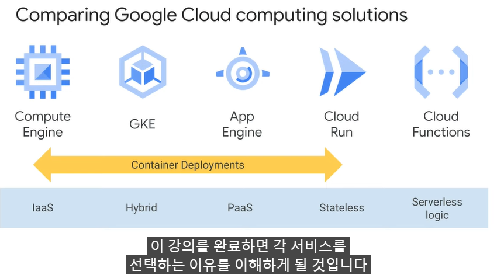
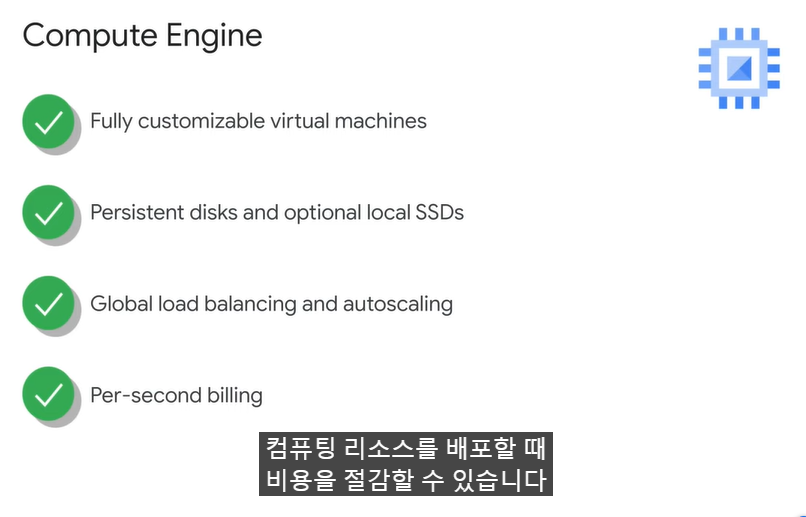

- Container를 Orchestrating한다.
- Declarative Configuration
    - 배포된 상태를 원하는 상태로 유지시킨다.
- Imperative Configuration도 가능하지만, 자동 유지하는 게 Kubernetes의 장점을 활용하는 것이다.

1. Stateful, Stateless App을 지원한다.
2. Autoscaling
3. Resource limits 설정
- Kubernets는 클러스터 내에서 전반적인 워크로드의 성능 개선을 할 수 있다.
4. Extensibility
5. Portability
- 오픈소스이기에 어디든 배포할 수 있다.

# Goolge Cloud Computing Solutions

## Compute Engine 

## App Engine
> 코드 작성에만 집중해야 하는 경우

## Goolge Kubernetes Engine

## Cloud Run
> stateless container 실행  

 

## Cloud Functions
> 이벤트 기반 func 실행  
  

